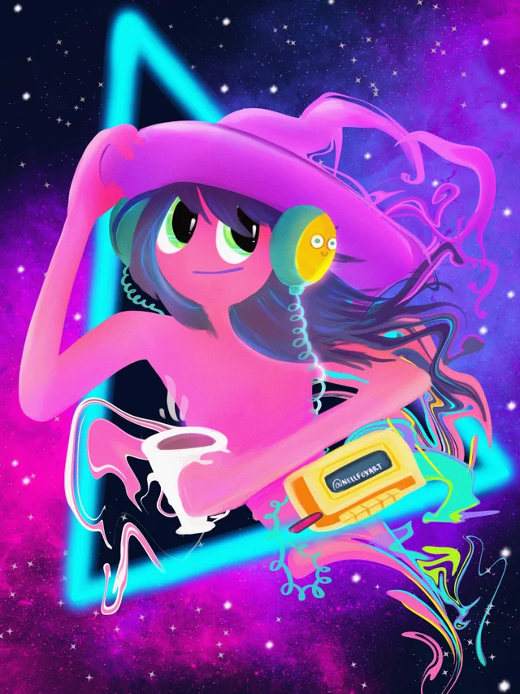

## <Hello, world. I'm Lucas. />
  
  
  
 .☕ Coffee Lover.
 .🎼 Electric guitar and indie beats.
 .🌌 Curious about the universe and the human mind.
 .📚 Software Engineering student 4/9 semesters.
 .🌍 Portuguese, English.

 .🌱 Learning React and TypeScript. 
 .🌐 <a target="_blank" href="fell-lucas.github.io">Portfolio / Resume </a>

“If you don't have a plan, you become part of somebody else's plan.”
― Terence McKenna

